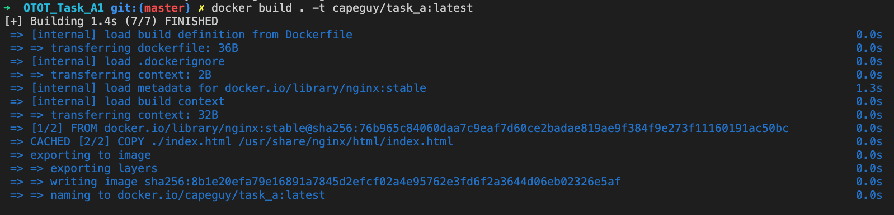
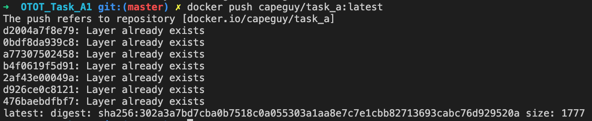
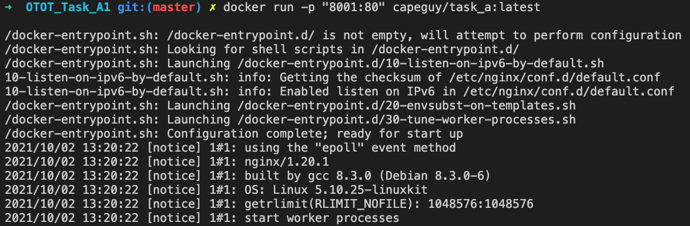

# Task A1
## Submission Information

| Option | Description |
| ------ | ----------- |
| Name   | Lau Jun Hao Benjamin |
| Matriculation Number | A01840840B |
| Link to GitHub Repository | https://github.com/capeguy/cs3219-otot/OTOT_Task_A1/ |
| Instructions | [Below](#foo) |
| Other Relevant Learnings | null |

## Instructions on how to run the Docker container
Build & Run Container
        
    docker build . -t capeguy/task_a:latest

    docker push capeguy/task_a:latest 

    docker run -p "8001:80" capeguy/task_a:latest

    
Replace `capeguy` with your own Dockerhub Username

Navigate to http://localhost:8001 on a Web Browser

