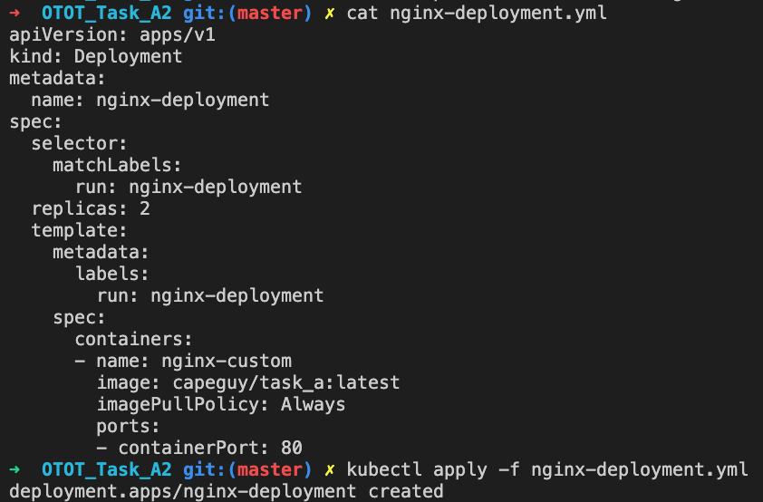
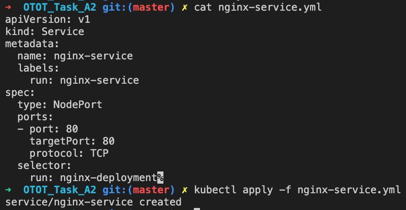
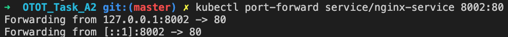

# Task A2
## Submission Information

| Option | Description |
| ------ | ----------- |
| Name   | Lau Jun Hao Benjamin |
| Matriculation Number | A01840840B |
| Link to GitHub Repository | https://github.com/Capeguy/cs3219-otot/tree/master/OTOT_Task_A2 |
| Instructions | [Below](#foo) |
| Other Relevant Learnings | null |

## Kubectl Commands
### Deploy Image

    kubectl apply -f nginx-deployment.yml
    

### Configure Service

    kubectl apply -f nginx-service.yml
    

    
### Access Deployed Image Through Service

Port Forward to service

    kubectl port-forward service/nginx-service 8002:80
    

    
Navigate to http://localhost:8002 on a Web Browser

