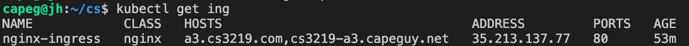
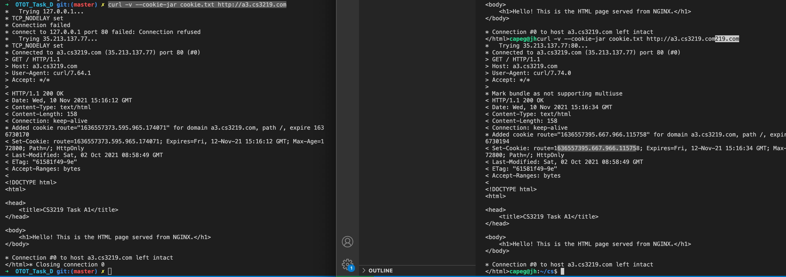
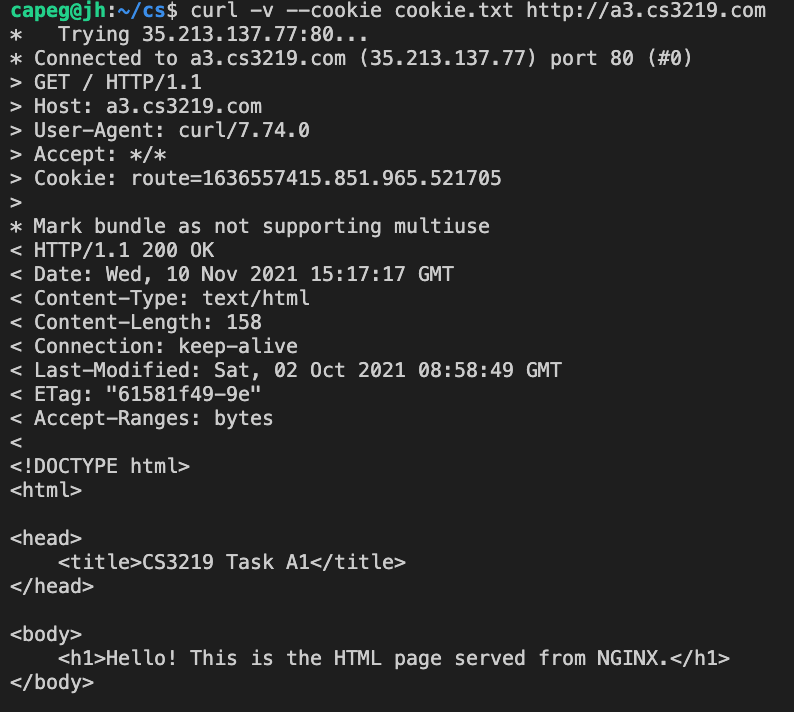
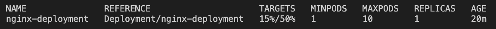
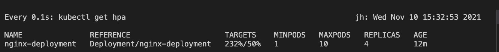

# Task A3
## Submission Information

| Option | Description |
| ------ | ----------- |
| Name   | Lau Jun Hao Benjamin |
| Matriculation Number | A01840840B |
| Link to GitHub Repository | https://github.com/capeguy/cs3219-otot/OTOT_Task_A3/ |
| Instructions | [Below](#foo) |
| Other Relevant Learnings | null |

## Kubectl Commands
### Create Ingress

```yml
apiVersion: networking.k8s.io/v1
kind: Ingress
metadata:
  name: nginx-ingress
  annotations:
    nginx.ingress.kubernetes.io/affinity: "cookie"
    nginx.ingress.kubernetes.io/session-cookie-name: "route"
    nginx.ingress.kubernetes.io/session-cookie-expires: "172800"
    nginx.ingress.kubernetes.io/session-cookie-max-age: "172800"
spec:
  ingressClassName: nginx
  rules:
  - host: a3.cs3219.com
    http:
      paths:
      - path: /
        pathType: Prefix
        backend:
          service:
            name: nginx-service
            port: 
              number: 80
```

    kubectl apply -f nginx-ingress.yml
    
### Use Ingress Controller

`ingressClassName: nginx` is used for the Ingress Controller with configurations for Sticky Session via Cookie



Update host file


Sending a request and save cookies

`curl -v --cookie-jar cookie.txt http://a3.cs3219.com`



Note that Response Header includes a "Set-Cookie", and each request is served by a differnet pod.

Sending a request with previously used cookie

`curl -v --cookie cookie.txt http://a3.cs3219.com`



Note that Response Header does not include a "Set-Cookie" and is served by the same pod as previously.

### Define Horizontal Pod Autoscaler and Prove Scalability

`kubectl autoscale deployment nginx-deployment --cpu-percent=50 --min=1 --max=10`

`kubectl get hpa`



Induce Load

`kubectl run -i --tty load-generator --rm --image=busybox --restart=Never -- /bin/sh -c "while sleep 0.01; do wget -q -O- http://cs3219-a3.capeguy.net; done"`

After some time, see that the number of replicas increases as load increases

