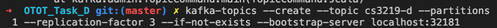
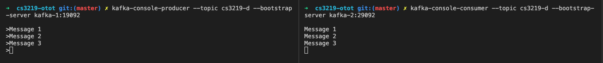
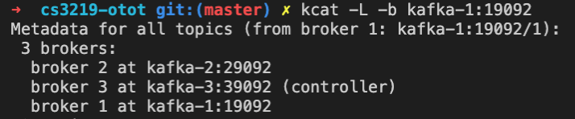
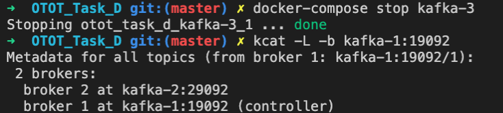
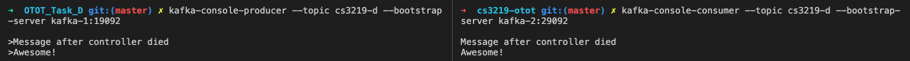

# Task A2
## Submission Information

| Option | Description |
| ------ | ----------- |
| Name   | Lau Jun Hao Benjamin |
| Matriculation Number | A01840840B |
| Link to GitHub Repository | https://github.com/Capeguy/cs3219-otot/tree/master/OTOT_Task_D |

## Start Containers in docker-compose.yml

1. Open a Terminal in OTOT_Task_D folder
2. Enter the following command: `docker-compose up`
3. Wait for the containers to be ready

## Create a topic

1. Enter the following command: `kafka-topics --create --topic cs3219-d --partitions 1 --replication-factor 3 --if-not-exists --bootstrap-server localhost:32181`

## Create a Publisher and Consumer to the topic

1. Open a new terminal and enter the following command: `kafka-console-producer --topic cs3219-d --bootstrap-server kafka-1:19092`
2. Enter any message
3. Open a new terminal and enter the following command: `kafka-console-consumer --topic cs3219-d --bootstrap-server kafka-2:29092`
4. See that the message is shown
5. You may go back to the previous terminal used for publishing to send more messages

## Identify the Controller

1. Open a new terminal and enter the following command: `kcat -L -b kafka-1:19092`
2. In this case the controller is `kafka-3`
   

## Stop the Controller and Identify the New Controller

1. Open a Terminal in OTOT_Task_D folder
2. Enter the following command: `docker-compose down kafka-3`
3. Open a new terminal and enter the following command: `kcat -L -b kafka-1:19092`
4. In this case the controller is now `kafka-1`

## Verify that Pub-Sub is still working

